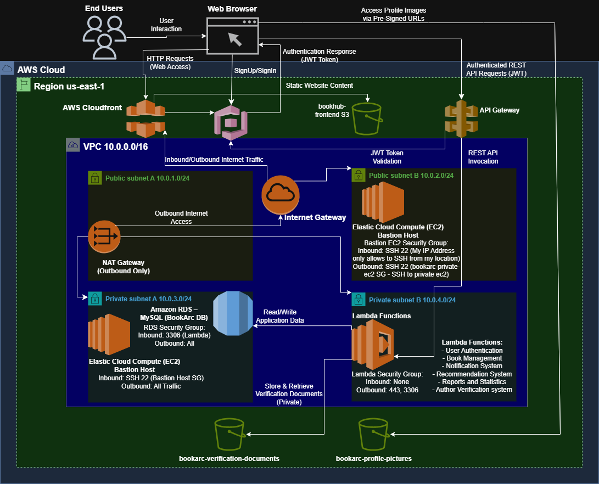

# 📚 BookArc – Cloud-Native Book Management & Recommendation Platform

BookArc is a **cloud-native web application** that allows users to:
- Browse and search for books
- Rate and review books
- Manage personal reading lists
- Compare book prices
- Receive personalized book recommendations
- Get system notifications (e.g., new reviews, book updates)

This project was developed as my **Cloud Computing graduation project**, focusing on **serverless architecture, scalability, and infrastructure as code**.

---

## 🛠️ Technology Stack

### ☁️ Cloud & Backend
- **AWS Lambda** – Serverless compute (For both the recommendation and notification system)
- **Amazon API Gateway** – REST API management
- **Amazon RDS (MySQL)** – Relational database
- **Amazon Cognito** – Authentication & user management
- **Amazon S3** – Static assets & image storage
- **Amazon CloudFront** – Global content delivery
- **Amazon VPC** – Network isolation and security
- **AWS EC2** – For database Administration used a Bastion Host (Jump) and a Private EC2

### 🧱 Infrastructure as Code
- **Terraform** – Provisioned VPC, CloudFront, Front-end S3 Bucket, and RDS
- **AWS Console** – Provisioned Cognito, API Gateway, Lambda Functions, EC2s, and S3 Buckets

### 🎨 Frontend
- **React.js**
- Hosted on **S3** and delivered via **CloudFront**

---

## 🏗️ Cloud Architecture

The cloud architecture of the BookArc platform:



📄 Detailed explanation:  
👉 [`docs/architecture/architecture-explanation.md`](docs/architecture/architecture-explanation.md)

---

## 🗄️ Database Design (ERD)

Relational database schema used by BookArc (MySQL on RDS):


📄 Entity descriptions:  
👉 [`docs/erd/erd-description.md`](docs/erd/erd-description.md)

---

## 📁 Repository Structure

```text
docs/         → Architecture diagrams, ERD, screenshots
terraform/    → Infrastructure as Code (AWS resources)
backend/      → Lambda functions & business logic
frontend/     → React frontend application
